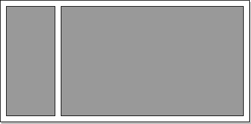
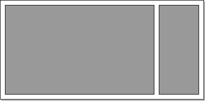
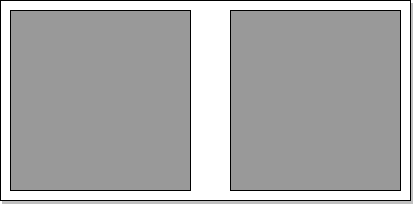
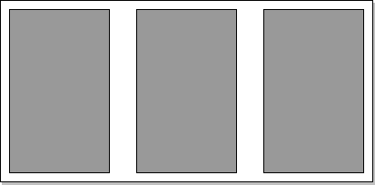

[](https://travis-ci.org/tato123/react-grits)

# Overview

A set of tools to build extensible layouts using [CSS grid](https://developer.mozilla.org/en-US/docs/Web/CSS/grid) specification. 

React-Grits attempts to reduce the complexity in sharing, debugging, and previewing standardized layouts by providing a thin layer on top of CSS grid.

# Installation

`npm install react-grits`

or through yarn 

`yarn add react-grits`

# API

Helpers
- createGridItemsForChildren
- createGridWithProps
- debug
- validate

Components
- Grid
- GridItem

Pre-defined templates 
- SplitHalf
- AsideLeft
- AsideRight
- Thirds


# Using a predefined layout

Each layout supports named `grid-areas`, if you forget to include a grid area name thats ok, we will automatically populate it for you.

```jsx
 import {AsideLeft} from 'react-grits';

// without a grid area defined
const MyPage = () => (
  <AsideLeft>
    <AwesomeSidebar/>
    <MainContent/>
  </AsideLeft>
)

// without defined grid areas
const MyPage = () => (
  <AsideLeft>
    <AwesomeSidebar gridArea="view2"/>
    <MainContent gridArea="view1" />
  </AsideLeft>
)
 
```


# Defining a custom layout
```jsx
import {Grid} from 'react-grits';

// start by defining your template areas
const templateAreas = [
    ["a", "b"],
    ["c", "c"]
];

// want to define split 50/50?
const templateColumns = "50% 50%";

// add validation rules, specify how many children are required
const validator = validate({minChildren: 3});

// Create our CSS grid
const Component = createGridWithProps({ templateAreas, templateColumns, columnGap });

// Enhance our component with debugging and validation
export default debug(validator(Component))
```

# Pre-Defined Application Layouts

These are a couple of included templates that can be used with any framework

## Aside Left
Provides a left sidebar and a main region seperated a column gap. This is a commonly seen pattern with dashboard sites and nav+data views.



**Code Example**

```jsx
import {AsideLeft} from 'react-grits';

<AsideLeft> 
   <Side gridArea="view1" />
   <Master gridArea="view2" />
</AsideLeft>
```

## Aside Right
Provides a right sidebar and a main region with a configurable gap distance. 



**Code Example**

```jsx
import {AsideRight} from 'react-grits';

<AsideRight>    
   <Master gridArea="view1" />
   <Side gridArea="view2" />
</AsideRight>
```

## Split Half Template
Splits each view equally into two columns seperated by a column gap.



**Code Example**

```jsx
import {SplitHalf} from 'react-grits';

<SplitHalf> 
   <FooView gridArea="view1" />
   <BarView gridArea="view2" />
</SplitHalf>
```


## Thirds
Provides a three column approach where each column has an equal width and an equal gap.



**Code Example**

```jsx
import {Thirds} from 'react-grits';

<Thirds> 
   <ACol gridArea="view1" />
   <BCol gridArea="view2" />
   <CCol gridArea="view3" />
</Thirds>
```


# License

Copyright 2017 Jonathan Fontanez

Permission is hereby granted, free of charge, to any person obtaining a copy of
this software and associated documentation files (the "Software"), to deal in
the Software without restriction, including without limitation the rights to
use, copy, modify, merge, publish, distribute, sublicense, and/or sell copies of
the Software, and to permit persons to whom the Software is furnished to do so,
subject to the following conditions:

The above copyright notice and this permission notice shall be included in all
copies or substantial portions of the Software.

THE SOFTWARE IS PROVIDED "AS IS", WITHOUT WARRANTY OF ANY KIND, EXPRESS OR
IMPLIED, INCLUDING BUT NOT LIMITED TO THE WARRANTIES OF MERCHANTABILITY, FITNESS
FOR A PARTICULAR PURPOSE AND NONINFRINGEMENT. IN NO EVENT SHALL THE AUTHORS OR
COPYRIGHT HOLDERS BE LIABLE FOR ANY CLAIM, DAMAGES OR OTHER LIABILITY, WHETHER
IN AN ACTION OF CONTRACT, TORT OR OTHERWISE, ARISING FROM, OUT OF OR IN
CONNECTION WITH THE SOFTWARE OR THE USE OR OTHER DEALINGS IN THE SOFTWARE.
